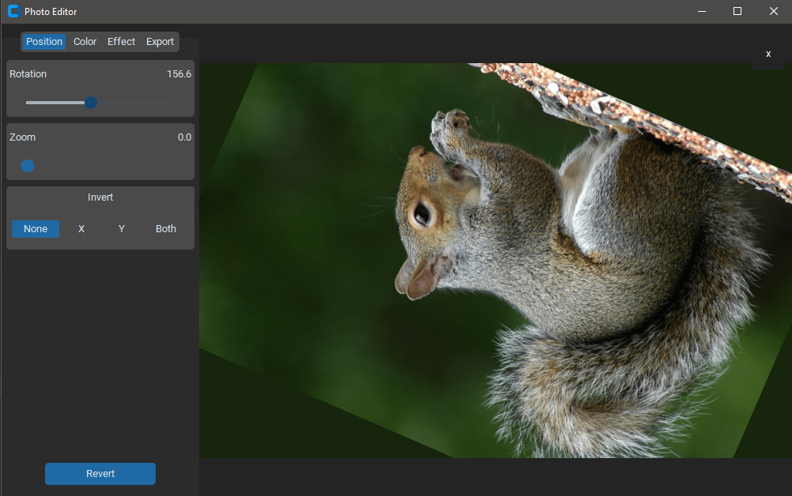
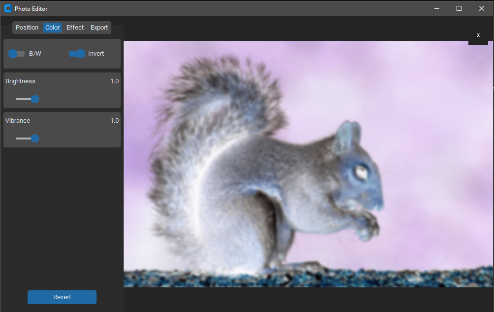
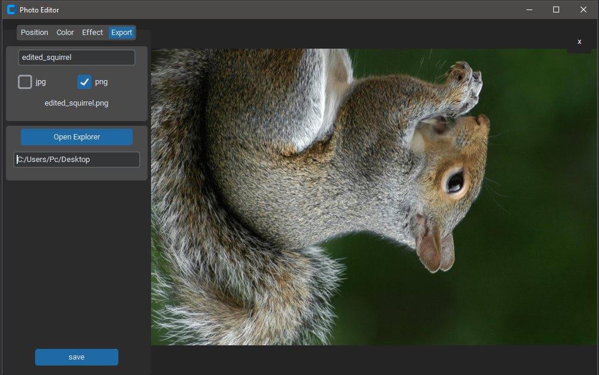

# Photo Editor App

This is a simple photo editor app built using Tkinter, a Python GUI toolkit. It allows users to perform basic image editing operations such as cropping, rotating, and applying filters to images.

## Features

 Users can rotate the image clockwise or counterclockwise by a specified angle. 
 Filter effects:** Users can apply various filter effects to the image, such as grayscale and blur. 
 Save edited image:** Users can save the edited image to their local machine.

## Prerequisites

- Python 3.6 or above
- Tkinter library (usually comes bundled with Python)

## Installation

1. Clone the repository:

   ```bash
   git clone https://github.com/AlexMilenkov1/PhotoEditorV1

2. Navigate to the project directory:
   cd PhotoEditorV1
   
Usage
1.Run the application:

 main.py 
 The application window will open, displaying the original image.

 Use the provided buttons or menu options to perform image editing operations.

 Once you are satisfied with the edits, click the "Save" button to save the edited image to your local machine.

Contributing
Contributions are welcome! If you find any bugs or want to add new features, please open an issue or submit a pull request.

License
MIT License

